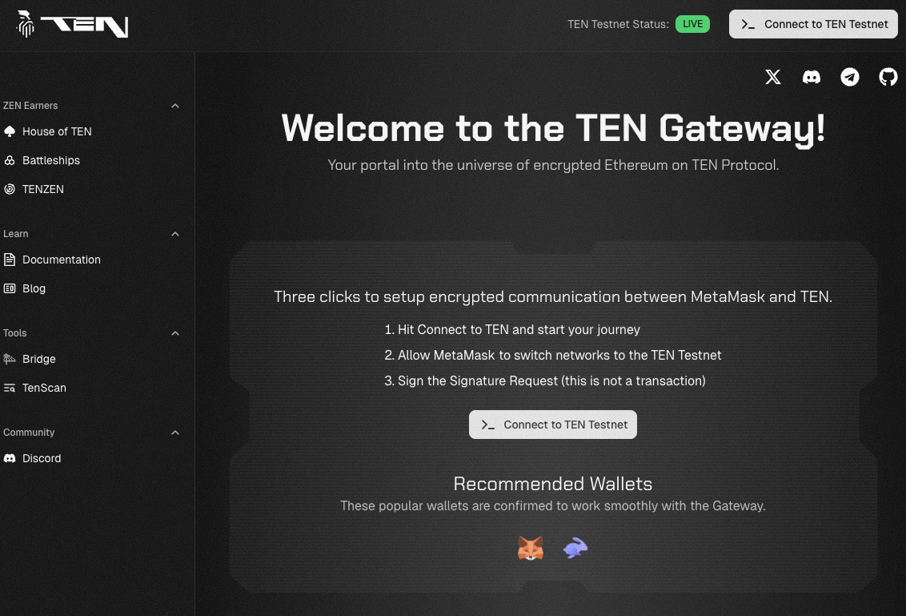

# Testnet

TEN Sepolia is our testnet that replicates the capabilities of the TEN Mainnet network. Linked to the Sepolia testnet, you can authenticate with the testnet TEN gateway, use the TEN faucet, and develop and deploy dApps for testing.

## TEN Gateway

Visit the TEN testnet gateway [here](https://testnet.ten.xyz/). Follow the on‑screen instructions to authenticate with the hosted gateway that allows you to interact with the testnet.

## Getting funds to the testnet

### **Option 1: Requesting Testnet ETH from the TEN Gas Station**

1. Make a note of your EVM wallet address or copy it to your clipboard.
2. Head over to [TEN Gas Station](https://faucet.ten.xyz/).
3. Paste your EVM wallet address into the wallet address field.
4. Log in with your Discord and X (Twitter) accounts.
5. Complete the available tasks to receive testnet ETH.

### **Option 2: Bridging Sepolia testnet funds to TEN**

If you already have ETH on the Sepolia testnet, you can bridge it directly to TEN Sepolia:

1. Go to the TEN testnet bridge: [`https://testnet-bridge.ten.xyz/`](https://testnet-bridge.ten.xyz/).
2. Connect your wallet (Sepolia network selected).
3. Choose how much Sepolia ETH you want to bridge from L1 to L2 (TEN).
4. Confirm the transaction in your wallet and wait for it to finalize.

## TEN Scan

You can use the TEN block explorer to view transaction data occurring on the testnet [here](https://testnet.tenscan.io/).
