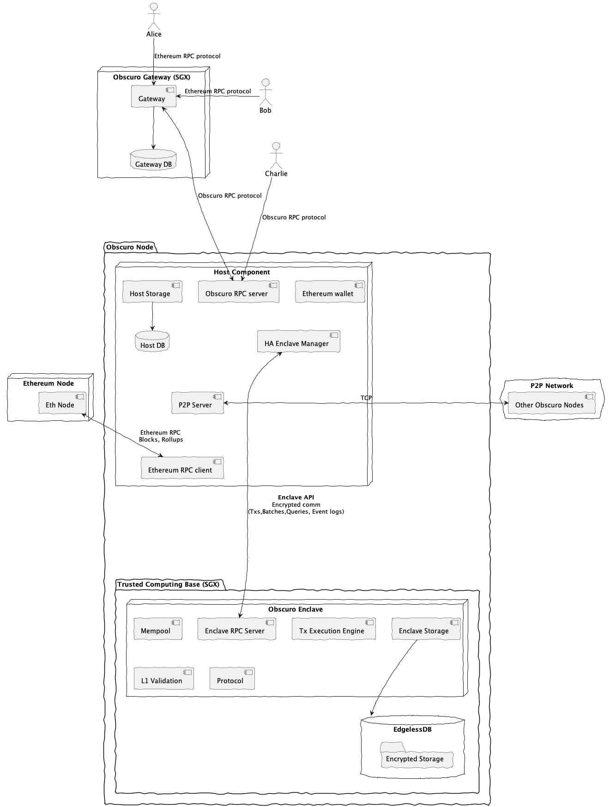

# Ten Node Architecture

This is an advanced document that describes the technical architecture of a Ten deployment.

While Ten has similarities with other Ethereum L2s, the setup is more complex, as shown in the following diagram 
that depicts the main components and their responsibilities.

*Note: The Ethereum node components are developed and maintained by third-parties. E.g.: Infura* 

## Trusted Computing Base (TCB)

Ten makes use of Intel SGX to protect the execution of transactions and the state from node operators.
For development, we use the EGo SDK from Edgless, and EdglessDB.

The Ten TCB has two components: the Ten Enclave, and the encrypted database. 

### The Ten Enclave
From a high level, the Ten Enclave(TE) is a process that exposes an RPC server (currently GRPC).

The TE is a process that loads the SGX enclave built from the source code. The EGo SDK handles the low level I/O interactions 
and communication.

The TE has two entry/exit points:
1. The RPC server
2. The Storage 

The next section will cover the main logical components of the TE.

### 1. The RPC server

The Ten Enclave reacts to information like: 
 - relevant Ethereum transactions to the Management Contract or the Message Bus.
 - encrypted Ten transactions submitted by users
 - Ten Batches submitted by the sequencer
 - data requests from users: tx receipts, "eth_call", etc 

There are RPC endpoints for each of these operations, and also a few more.

[//]: # ( produce challenges. The sequencer can produce batches and rollups.)

### 2. Transaction Execution Engine

The current version of Ten reuses the EVM execution engine from ``go-ethereum``.
We built a wrapper around it where we do some pre and post processing, but the execution itself is un-changed. 

We also replaced the k/v storage used by the ``go-ethereum`` EVM engine. 

### 3. The Storage
The TE is a stateful component that needs access to both the EVM state and the Ten chain information.

The TE establishes a mutually authenticated TLS connection to another enclave running a SQL engine.
The SQL read or write statements are submitted over this encrypted, secure connection.

### Error Handling
The enclave can return:
1. System Errors - These are unexpected errors caused by various malfunctions. E.g. The disk is full 
2. User Errors - they happen as a result of a user request that can't be handled because of the request itself.

The TE will encrypt the User Errors such that only that user can understand them.
And it will return the system errors in plain text such as they can be handled. 

### EdglessDB

## The "Host" Component

## The Ten Gateway

* **The enclave:** The trusted part of the Ten node that runs inside a trusted execution environment (TEE)
* **The host:** The remainder of the Ten node that runs outside the TEE
* **The Ten management contract:** The Ethereum mainnet contracts required by the Ten protocol, described 
  [here](https://whitepaper.obscu.ro/Ten-whitepaper/l1-contracts)
* **Client apps:** Applications that interact with the Ten node (e.g. Ten wallets)

## Host/enclave split

The node is divided into two components, the host and the enclave. Wherever reasonable, node logic should be part of 
the host rather than the enclave. This has two benefits:

* It minimises the amount of code in the 
  [trusted computing base (TCB)](https://en.wikipedia.org/wiki/Trusted_computing_base)
* It reduces churn in the TCB, reducing the frequency of re-attestations

The host and the enclave are two separate OS processes, rather than separate threads in a single process. This is 
because our initial target TEE, [Intel SGX](https://en.wikipedia.org/wiki/Software_Guard_Extensions), requires the 
TEE to execute as a separate process.

The host and the enclave communicate via RPC, using the [gRPC](https://grpc.io/) library. gRPC was selected as it is 
open-source (Apache 2.0) and has broad adoption.

For simplicity, this transport is not authenticated (e.g. using TLS or credentials). One possible attack vector is for 
a _parasite_ aggregator to only run the host software, and connect to another aggregator's enclave to submit 
transactions, in order to economise on operating costs. To avoid this scenario, the enclave is designed to have full 
control over which account receives the rollup rewards, meaning that a would-be parasite aggregator does not receive 
any rewards for acting in this manner.

To reduce coupling, the enclave process will be monitored and managed by a supervisor, and not by the host process.

## Host design

The host has a lot of responsibilities, including:
- serving requests for data and transaction submissions
- feeding data to the enclave to keep it up-to-date with the L1 and L2 networks
- publishing secret request/responses and (for the sequencer) rollups to the L1 network
- receiving and publishing Ten data (e.g. batches and mempool transactions) with peer nodes
- managing failover and recovery for the enclave for high-availability (HA) nodes

The host will be organised with a variety of services to manage these responsibilities.

The following diagram shows a high-level view of the main services involved:

