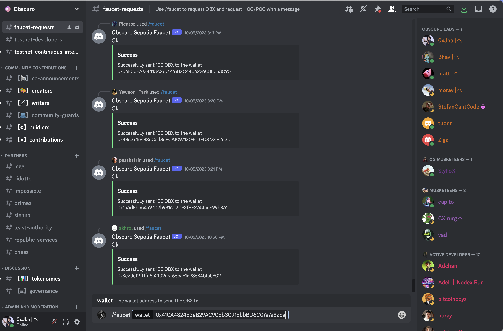

# Ten Faucet

Using the steps provided, you can request testnet ETH from the faucet available on the Ten Discord server.

## **Prerequisites**
- Make sure you have completed your wallet set up or else follow the [instructions](/docs/getting-started/for-users/setup-you-wallet).

## **Requesting Testnet ETH**
1. Make a note of your wallet address or copy it to your clipboard.
2. Join the Ten [Discord server](http://discord.gg/hbbfThQHT3).
3. Open the `faucet-requests` channel on Ten Discord in the development category.
4. Request ETH using the `/faucet` command. The faucet will credit 0.5 ETH by default.
5. Provide your wallet address and hit Enter. The faucet will acknowledge your request.
6. Your wallet should receive ETH shortly.
