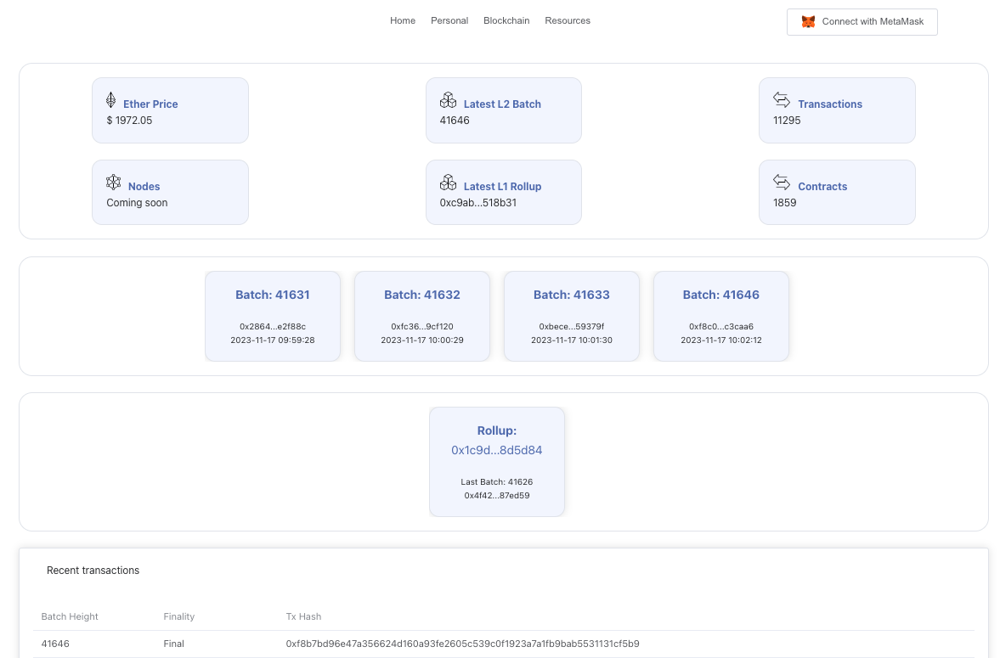

# ObscuroScan

 

 

[ObscuroScan](https://testnet.obscuroscan.io) is a blockchain explorer for the Obscuro Testnet - Obscuro’s equivalent of Etherscan. ObscuroScan allows you to view the latest rollups and transactions on the Testnet, as well as search for historical rollups and transactions. Its functionality will be expanded over time.

:::info
ObscuroScan is still in its testnet phase. Expect more features in the future as its functionality expands.
:::

## Usage

1. Go to the ObscuroScan landing page.
2. Observe the feed of latest rollups and transactions. Click on any rollup number or transaction hash to see the details of the corresponding rollup and the L1 block where it was published.
3. From the search bar in the top right, search for any rollup (using its number, e.g. `2453`) or transaction (using its hash, which will start with `0x`, e.g. `0x5476edbf2c6cc1279d2334b2c80e26333d0eaca6c1807c7d8a2945b1a9d58f07`).

## Decryption of Transaction Blobs

Notice the **Decrypted transaction blob** section for each rollup. This allows you to see the normally-encrypted transactions in unencrypted plain text.

:::warning
On the Testnet, transactions can be decrypted because it uses a rollup encryption key that is long-lived and well-known. It's designed to help developers debug and users understand how Obscuro works. On the Mainnet, rollups will be encrypted with keys that are not known to anyone, or anything, other than the Obscuro enclaves.
:::
